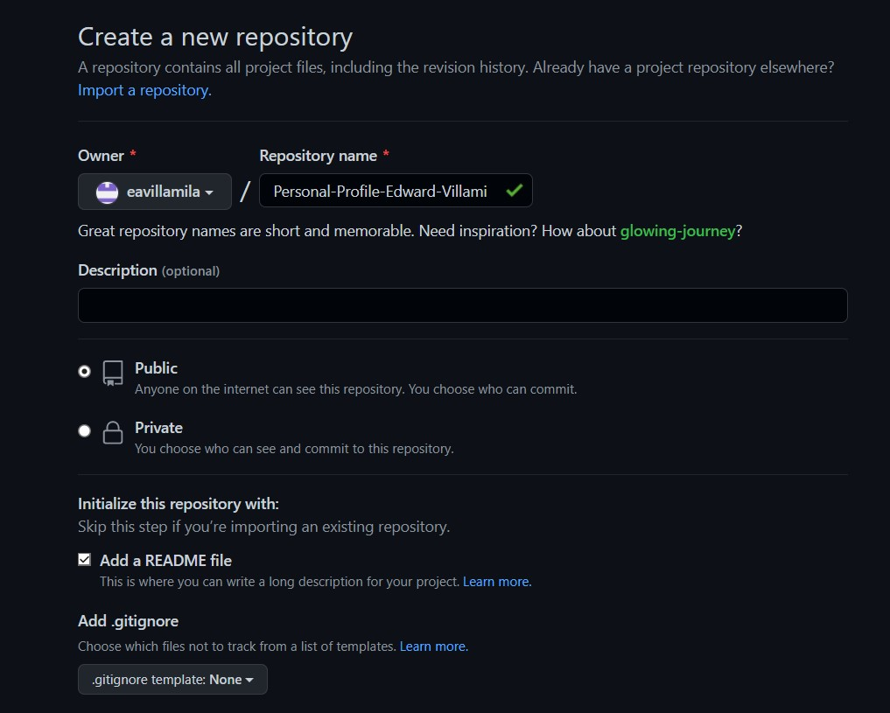

# ***SEMILLERO DEVOPS - BANCO POPULAR***
## **Taller - Repositorio GitHub - Módulo Git**
#### **Elaborado por:** *Edward Alonso Villamil Avellaneda*

# **Documentación del Taller Git**

[**Perfil de Edward Villamil**](https://eavillamila.github.io/Personal-Profile-Edward-Villamil/)

A continuación, se describe el desarrollo del taller del módulo de Git. La actividad estuvo bajo la guía y apoyo del ingeniero DevOps [**Edisson Giovanni Zuñiga**](https://giovanemere.github.io/Edisson-Giovanni-Z-Lopez/).

---------

Este taller consistía en la creación y configuración de un repositorio en los servicios de GitHub, junto con la implementación de un sitio (page) que aloja la hoja de vida o perfil profesional de autor.

A continuación, se presentan los aspectos más importantes o destacados del desarrollo de cada uno de los items que integra el taller.

## *Creación del Repositorio*

Para el desarrollo de este taller primero se debe crear el repositorio, para lo cual vamos a la página inicial de GitHub y damos click en `New`, en cualquiera de las vistas de los repositorios dentro del entorno de GitHub. A continuación, se muestra un ejemplo:


Luego, diligenciamos los datos del repositorio: nombre, descripción y si es público o privado. Es importante seleccionar la opción `Add a README file`, para evitar tener que crear luego el archivo. Luego damos click en `Create repository`



Tras la creación, GitHub te enviará a la página de inicio del respositorio que creaste. 

## *Creación de la Rama*

El siguiente paso es crear la(s) rama(s) necesaria(a). Para nuestro ejercicio, creamos una llamada `gh-pages`, ya que es la predeterminada para la creación de la page GitHub. Para eso, damos clic sobre la rama `main` y escribimos el nombre (`gh-pages`), por último, damos clic en `Create branch: gh-pages`


## *Contenido del README.md*

El contenido de nuestra page GitHub se debe ingresar en el archivo `README.md` que se creo junto con el repositorio. En nuestro caso, el contenido es la hoja de vida o perfil profesional del autor. Este archivo se contruye con lenguaje Markdown, aunque se pueden emplear elmentos de HTML.

No se darán muchos detalles sobre el desarrollo de este documento, ya que no es un trabajo muy eleaborado, sino que contiene estructuras y elementos básicos. Podemos ver una vista previa de este documento de manera inmediata con tan solo ubicarlos (ingresar) en la rama `gh-pages`, sobre la que se hicieron los cambios, dentro del ambiente o servicio de GitHub, como se muestra a continuación:


El contenido se subió en Inglés, pero no tiene ninguna razón particular.

## *GitHub Page*

Para ingresar a nuestra GitHub Page, o conocer la URL a través de la cual podemos acceder a ella, debemos dar clic en los ajustes del repositorio (`Settings`) e ir a la opción `Pages` en el panel lateral izquierdo. Aquí encontraremos la URL frente al texto `Your site live at `..., pero también verás la opción `Visit site` donde podrás ir de manera directa al sitio.


Esto te enviará a una ventana como la siguiente, pero donde no habrá un template, porque aún no se ha configurado. Encontrarás el contenido de tú archivo `README.md`, sobre un lienzo blanco y sin muchas variaciones en relación a la vista previa que puedes ver cuando estás sobre la rama `gh-page` en la página de GitHub.


## *Elección del Template*

Para la elección del template nos apoyamos en la siguiente página: [GitHub Pages Themes](https://pages.github.com/themes/). Este recurso muestra y direcciona hacia los principales template gratuitos disponibles para darle formato y presentación a nuestra hoja de vida o perfil profesional. La lista incluye las siguientes opciones:


Cuando ingresas a la opción desdeada te aparece la documentación del template. Ahí puedes ver una vista previa de la página en el link disponible en la frase `preview the theme to see what it looks like`.


Dentro de la documentación se dan las indicaciones para implementarlo. En general, lo que se debe hacer es crear un archivo llamado `_config.yaml` en la rama sobre la que se está trabajando (`gh-pages`). La estructura básica será:

    ```yml
    remote_theme: pages-themes/nameTamplate
    plugins:
    - jekyll-remote-theme
    ```

En este archivo puedes agregar opciones adicionales, como el título del sitio, una descripción, activar o desactivar las opciones de descarga, tener analíticas de Google, entre otras cosas. Todo está en la documentación.

Para nuestro trabajo, hemos decidido emplear el tema Cayman. El archivo de configuración [`_config.yaml`](https://github.com/eavillamila/Personal-Profile-Edward-Villamil/blob/gh-pages/_config.yaml) muestra unas pocas configuraciones que fueron necesarias para el objetivo del taller, que basicamente son: 

## *Lenguajes Utilizados*

Para el desarrollo de este taller se emplearon cuatro lenguajes de programación, que son:

* **Markdown:** Fue usado para la construcción del `README.md` y para la elaboración de esta documentación. Se usaron estructuras básicas y nos apoyamos en el siguiente recurso para su manejo: [https://tutorialmarkdown.com](https://tutorialmarkdown.com)
* **Shell Script:** Este lenguaje fue el empleado para el manejo del repositorio desde un servidor o un computador personal, ya que toda la edición y preparación del contenido no se hizo directamente en GitHub. Para automatizar el proceso se crearon dos scripts, uno que apoya la clonación y las configuraciones iniciales de Git, y otro que realiza el cargue en el repositorio remoto. Los script están en la carpeta [gitScripts/](https://github.com/eavillamila/Personal-Profile-Edward-Villamil/tree/gh-pages/gitScripts).
* **YAML:** El uso de este lenguaje fue superficial y no requirió de un aprendizaje previo, ya que se empleo solamente para el uso y confugiración del template de nuestra GutHub Page.
* **Git:** El lenguaje Git se empleo en las configuraciones iniciales del repositorio y en el cargue al repositorio remoto. Esto estaba automatizado dentro del los Shell Scripts mencionados antes.


## *Configuración y Actualización de Git*

Este parte del taller fue automatizada con los Shell Scripts de Git, los cuales se encuentran en la carpeta [gitScripts/](https://github.com/eavillamila/Personal-Profile-Edward-Villamil/tree/gh-pages/gitScripts). Aquí se realiza en primer lugar las configuraciones iniciales del repositorio local, donde clonamos, agregamos el user, el email, le indicamos que los archivos están en formato para Windows, y si es necesario quitamos la validación de los certificados SSL. Los comandos básicos empleados son:

    ```bash
    git clone "urlRepositorio"
    git config --global user.name "nombreUsuario"
    git config --global user.email "correo GitHub"
    git config --global core.autocrlf false
    git config --global http.sslVerify false
    ```

Por otro lado, también podemos ver el estado del respositorio local y las ramas disponible, o cambiar de rama, con los comandos:

    ```bash
    git status
    git branch -r
    git checkout "nombreRama"
    ```
 
Para la actualización del repositorio remoto o cargue debemos usar los comandos:

    ```bash
    git add .
    git commit -m "comentario"
    git push origin "nombreRama"
    git status
    ```

Para traer los cambios desde el repositorio remoto usamos:

    git pull